================
 AWS環境の準備
================

AWS マネジメントコンソールにサインイン
=======================================

まずは、WiFiに接続して、AWS マネジメントコンソールにサインインして下さい。

IAMユーザーではなく、ルートアカウントを使用する場合
^^^^^^^^^^^^^^^^^^^^^^^^^^^^^^^^^^^^^^^^^^^^^^^^^^^^^^^^^^^^^^^^^^^

ルートアカウントでログインする場合は、下記のURLからAWSにサインインして下さい。

https://console.aws.amazon.com/console/home

複数の参加者で1つのAWSアカウントを共用する場合
^^^^^^^^^^^^^^^^^^^^^^^^^^^^^^^^^^^^^^^^^^^^^^^^^^^^^^^^^^^^^^^^^^^

下記のURLにアクセスし、アカウントID、ユーザー名、パスワードを入力し、AWSマネージメントコンソールにサインインして下さい。

複数の参加者で1つのAWSアカウントを共用している場合、ルートユーザーにAWSマネジメントコンソールにログインするURLを教えてもらってください。通常、下記の様なURLになっています。

https://<12桁のAWS ID>.signin.aws.amazon.com/console

============= ============================
項目              値
============= ============================
アカウント	        AWSのアカウントID (12桁の数字)
ユーザー名         IAMユーザー名
パスワード         IAMユーザー パスワード
============= ============================

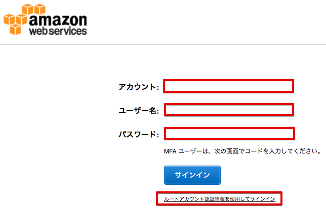

|

CloudFormationを使って自動作成
==============================

以下のハンズオンで必要なAWS IoT以外のサービスについてはCloudFormationを使って自動作成します。CloudFormationはスタックの中にこれらのリソースを作成し、一括して削除などができます。

IAMユーザ
    Edisonで認証に利用する証明書の登録作業を実施する際に使用するユーザ

IAMロール
    AWS IoTやブラウザがAWSサービスにアクセスするために使用するロール

IAMポリシー
    AWS IoTやブラウザが使用する各ロールがどのサービスに、どのような操作を行って良いか定義するポリシー

DynamoDBテーブル
    シナリオ１でセンサーデータを保存するためのテーブル

SNSトピック/サブスクリプション
    シナリオ１でメール通知するためのSNS設定

Lambdaファンクション
    WebブラウザからのリクエストでAWS IoTからデータを取得したり、データを設定するためのファンクション

マネージメントコンソールを開き、右上のリージョン一覧から[米国東部（バージニア北部）]を選択します。別なリージョンをお使いの場合は、適宜、選択して下さい。

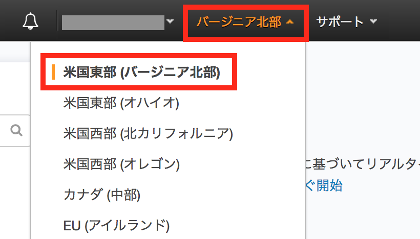

|

サービス一覧から[Cloud Formation]をクリックして開きます。[スタックの作成] をクリックします。

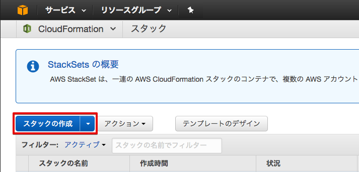

|

[テンプレートの選択] では [テンプレートの選択] で [Amazon S3 テンプレート URL の指定] を選択し、以下のパスを入力し、[Next]をクリックします。

https://s3-ap-northeast-1.amazonaws.com/awsiot-handson-dojo-jp/aws-iot-handson-dojyo-basic.yml

|

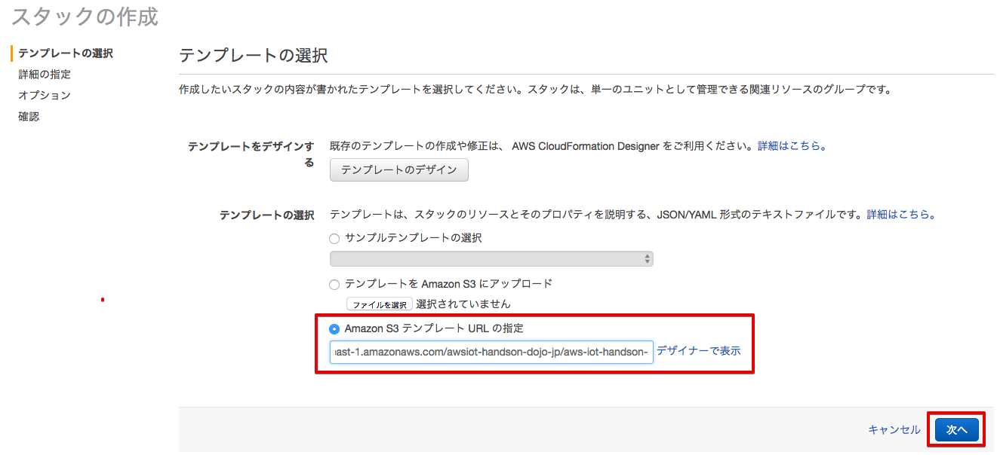

[詳細の指定] で [スタックの名前] に”AWSIoTHandsonStack-<参加者番号>”と入力し、[AdministratorEmail] にシナリオ１で使用するメールの通知先を入力します。そして[Next]をクリックします。

===================== ================================================
項目                      値
===================== ================================================
スタックの名前             AWSIoTHandsonStack-<参加者番号>
AdministratorEmail       通知先のE-mailアドレス
===================== ================================================

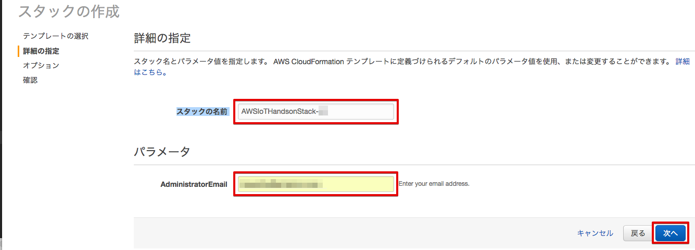

|

[オプション] で何も入力せずに [次へ] をクリックします。

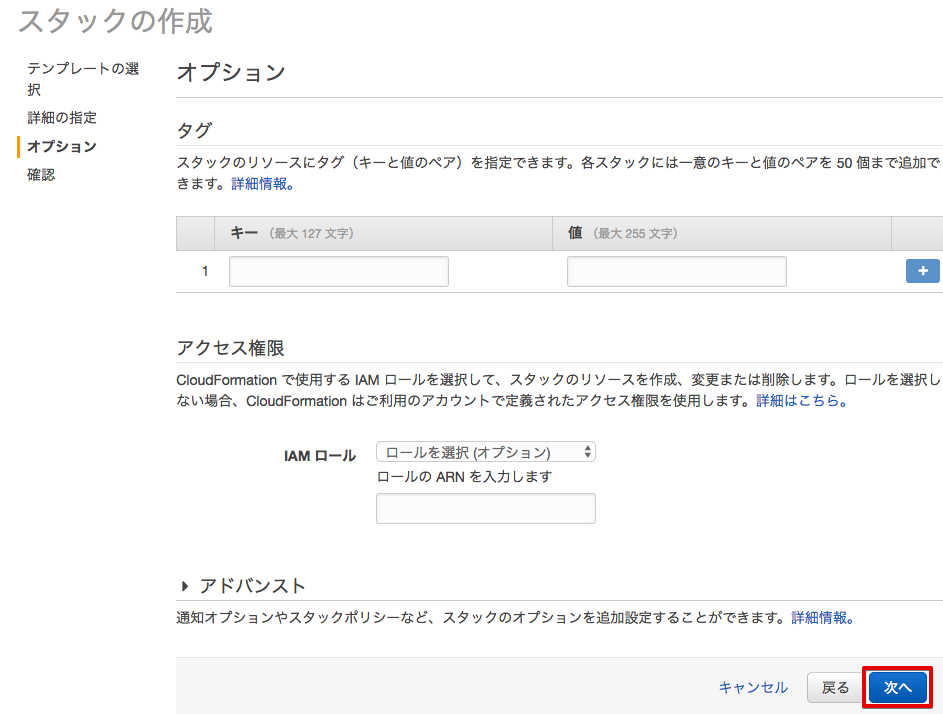

|

[確認] の画面を下にスクロールし、[CAPABILITY] で [AWS CloudFormation によって IAM リソースが作成される場合があることを承認します。] にチェックを入れ、[作成] をクリックします。

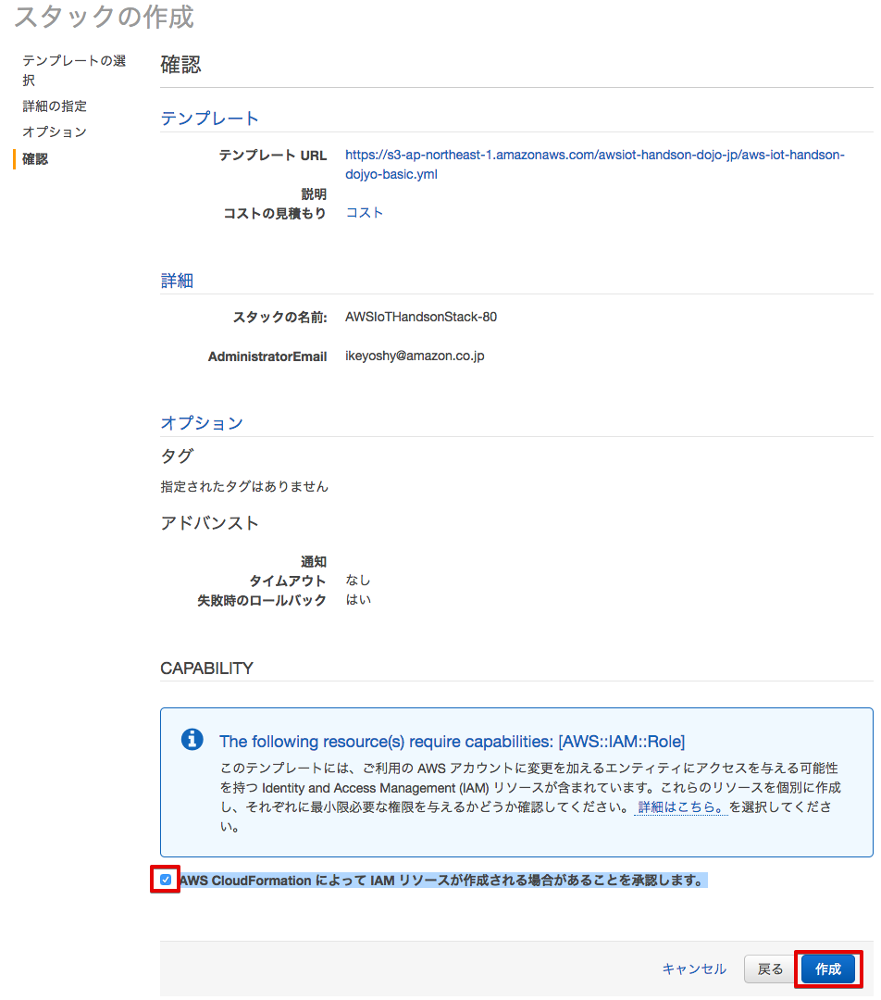

|

Cloud Formationのスタックの一覧に作成したスタックが表示されるのを確認します。Statusが[CREATE_IN_PROGRESS]から[CREATE_COMPLETE]になるのを待ちます。

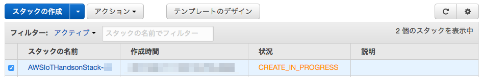

|

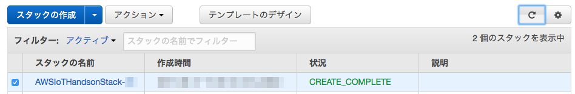

|

[AWSIoTHandsonStack-<参加者番号>] をクリックして、[スタックの詳細] を表示します。[出力] をクリックして、[値] の内容を全てメモ帳などにコピーします。

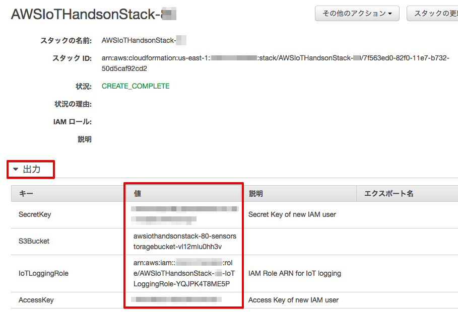

|

Cognito Identityを手動作成
===========================
シナリオ１，２で使用するWebアプリで匿名認証を行うために使用するCognito Identityを作成します。マネージメントコンソールのサービス一覧から [Cognito] をクリックして開き、[フェデレーテッドアイデンティティの管理] をクリックします。

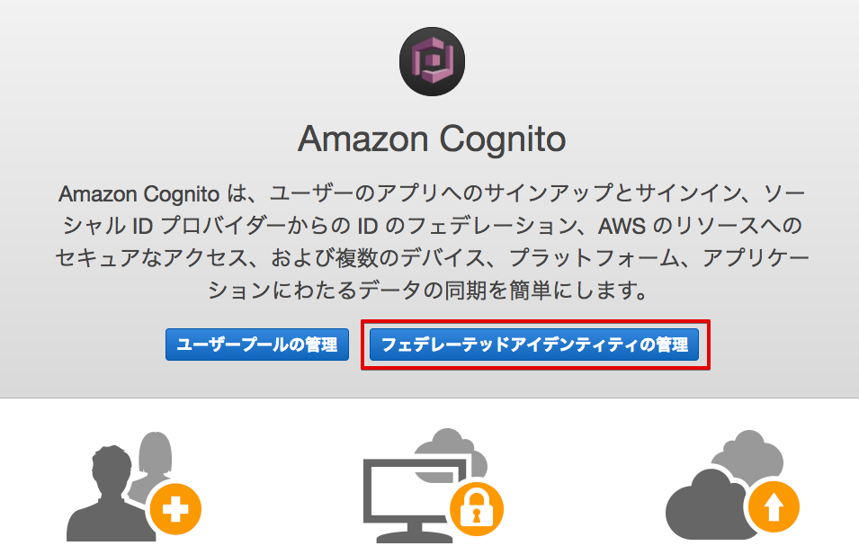

|

[新しい ID プールの作成] をクリックします。

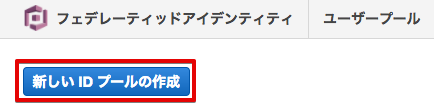

|

[ID プール名] に ”AWSIoTHandson <参加者番号>”と入力し、[E認証されていない ID に対してアクセスを有効にする] にチェックを入れ、[プールの作成] をクリックします。

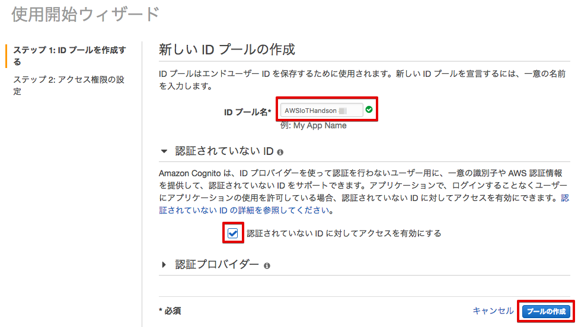

|

[許可]をクリックします。

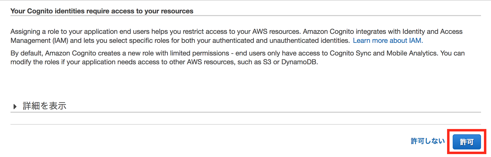

|

以下のように[AWS 認証情報の取得] に表示されている "ID プールの ID" をメモ帳などにコピーします。

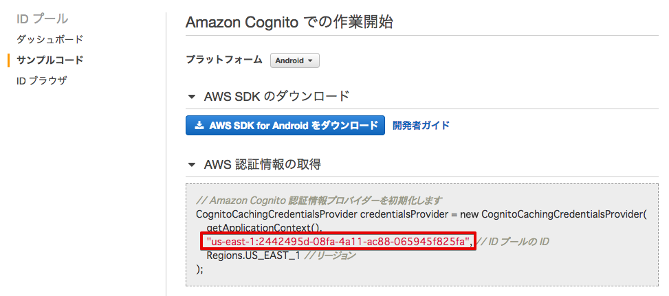

|

マネージメントコンソールのサービス一覧から[IAM]を開き、左側のメニューから[ロール]を選択します。ロールの一覧から”Cognito_AWSIoTHandson<参加者番号>Unauth_Role”をクリックします。

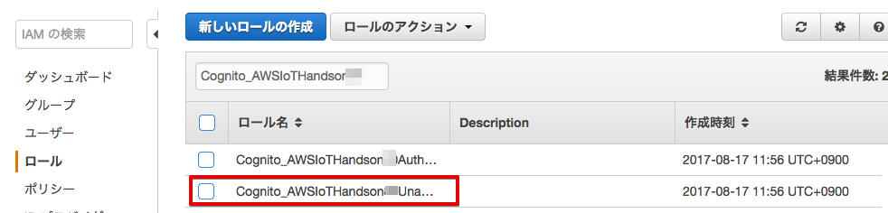

|

[アクセス許可]のタブを選択し、管理ポリシーの[ポリシーのアタッチ]をクリックします。

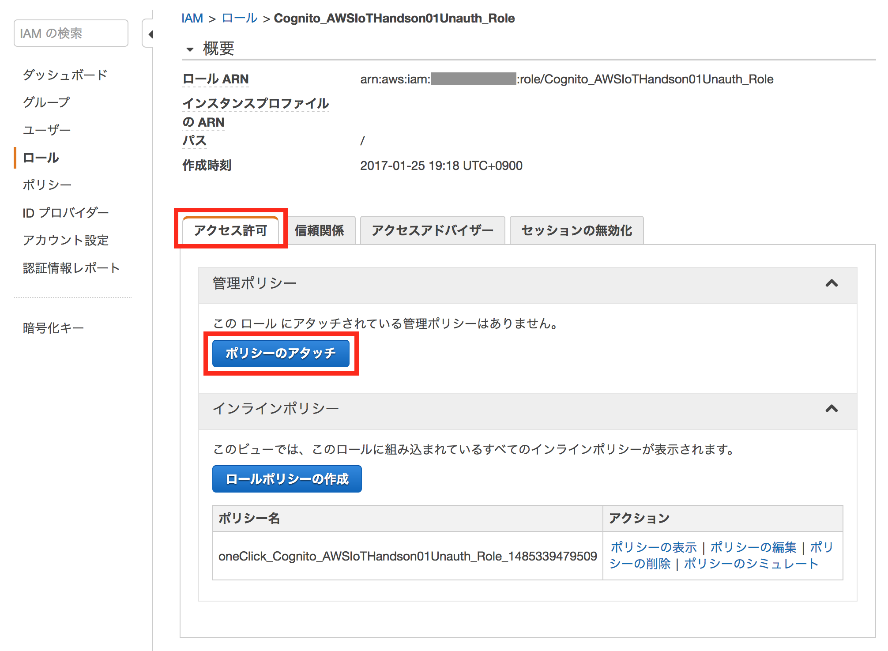

|

フィルタに”HandsonStack-<参加者番号>”と入力して絞込を行い、表示されたポリシー ”AWSIoTHandsonStack-<参加者番号>-WebAppPolicy-<英数字>” を選択し、[ポリシーのアタッチ]をクリックします。

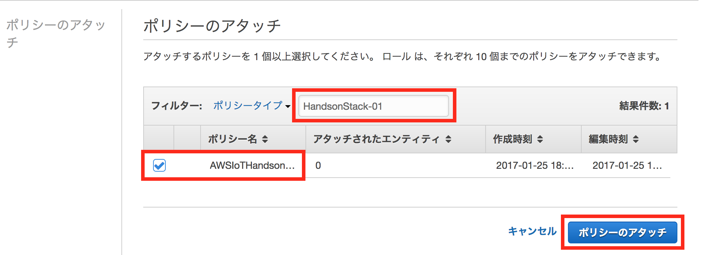

|

[管理ポリシー]に ”AWSIoTHandsonStack-<参加者番号>-WebAppPolicy-<英数字>” ポリシーが表示されていることを確認します。

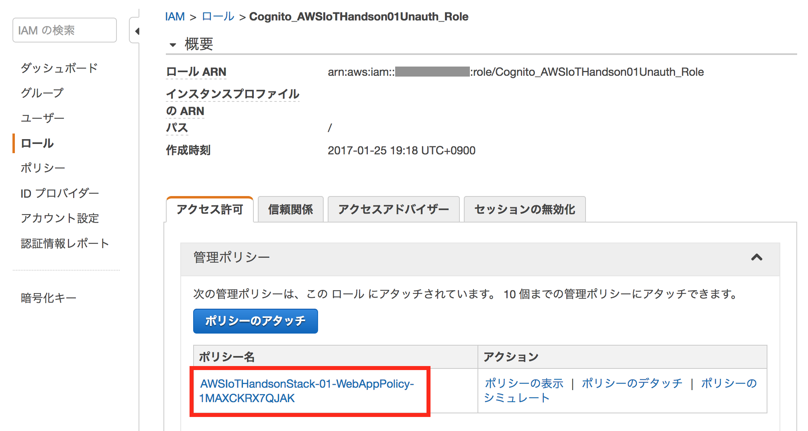

|
