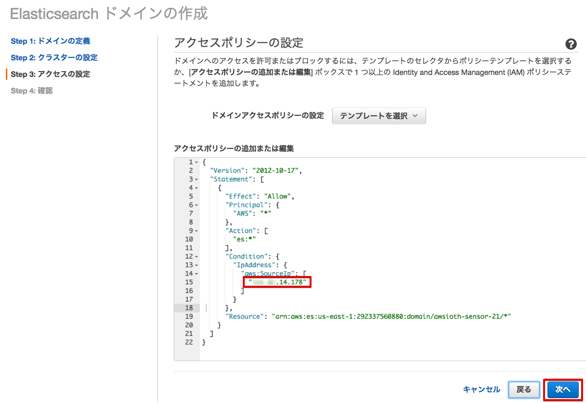
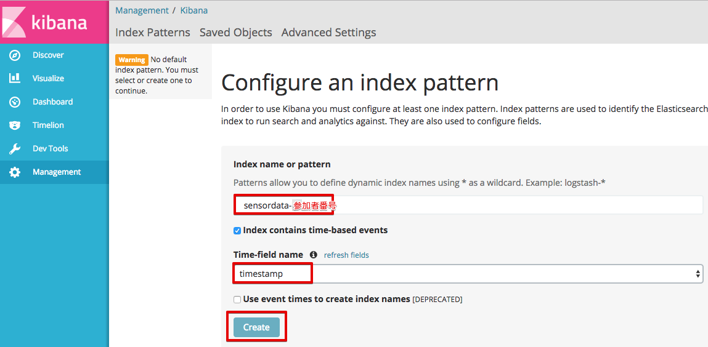
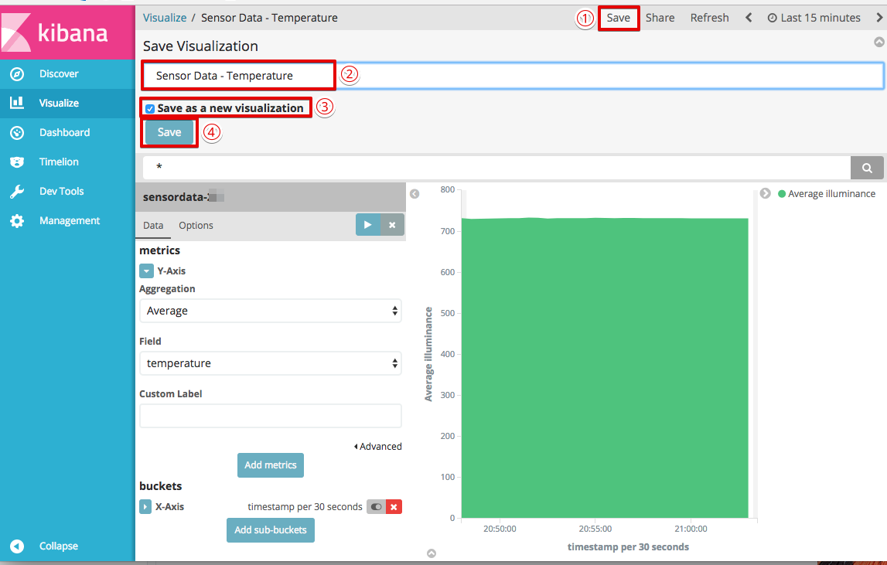
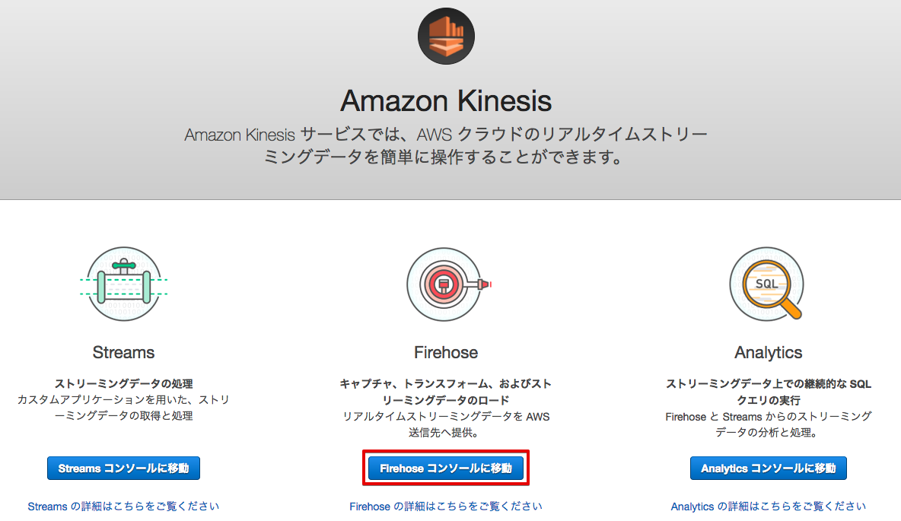
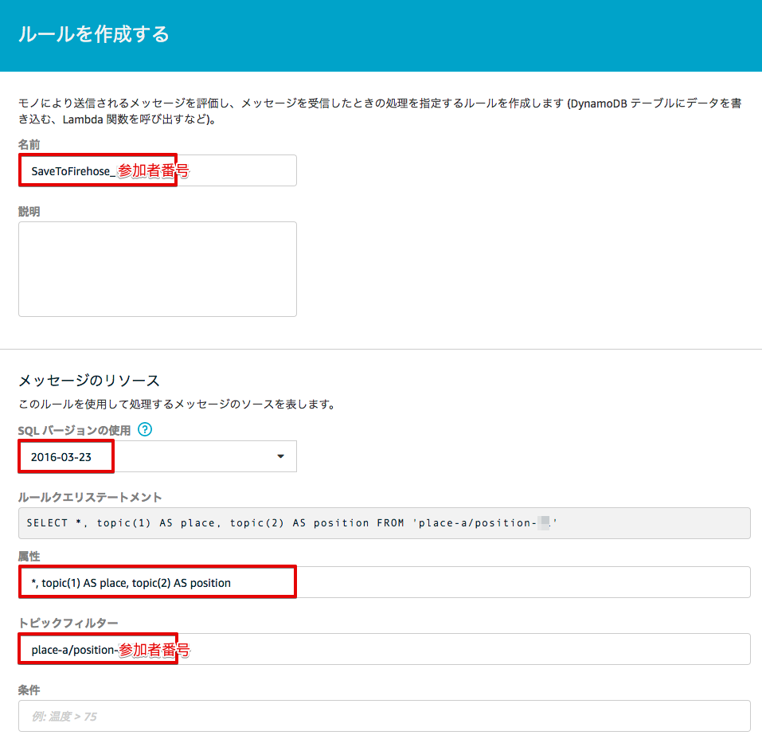
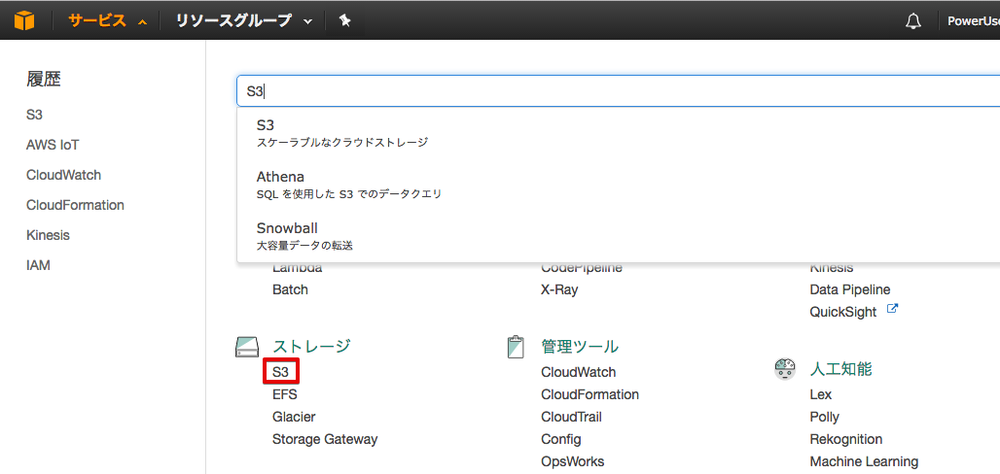

===========================================
シナリオ1＋: センサーデータの送信
===========================================

Intel Edisonに接続された照度センサーと温度センサーのデータをEdison上のプログラムで定期的にAWS IoTに送信します。AWS IoTではルールに基づきElasticSearch ServiceやFirehose経由でS3に保存します。WebブラウザからはElasticSearch Service上のKibanaにアクセスして保管されているデータをグラフ表示できます。

.. image:: images/scenario1-plus.png

|

送信するセンサーデータは以下のJSONフォーマットとします。

::

  {
     "timestamp": "2015-10-24T14:16:37.305Z", ← ISO8601形式
     "illuminance": "300",                    ← 照度センサーのアナログ値
     "temperature": "200"                     ← 温度センサーのアナログ値
   }

|

プログラムの実行
======================

シナリオ1: センサーデータの送信 で使用した、~/aws-iot-handson-dojo-basic/scenario1/main.js を実行して下さい。このシナリオ終了時までそのまま動かし続けます。ハンズオン終了時にプログラムを終了させる場合はCtrl+Cを押します。

::

  # cd ~/aws-iot-handson-dojo-basic/scenario1/
  # node main.js
  Connected to Message Broker
  Publishing: {"timestamp":"2016-04-06T07:05:08.973Z","illuminance":343,"temperature":510}
  Publishing: {"timestamp":"2016-04-06T07:05:14.035Z","illuminance":343,"temperature":512}
  Publishing: {"timestamp":"2016-04-06T07:05:19.084Z","illuminance":343,"temperature":512}

|

ElasticSearch Serviceのドメインを作成する
==============================================

グローバルIPアドレスを調べる
-------------------------------------

Kibanaを特定のIPアドレスからだけアクセスさせるために、PCのグローバルIPアドレスを調べます。下記のURLにアクセスしてください。

https://www.cman.jp/network/support/go_access.cgi

.. image:: images/grobal_ip.png

|

グローバルIPアドレスが表示されるので、ノートパッドなどに記録しておいて下さい。

ElasticSearch Serviceのドメインを作成
------------------------------------------

サービス一覧から[ElasticSearch Service] をクリックして開きます。

.. image:: images/es.png

|

Elasticsearch Serviceの画面が開きますので、[新しいドメインの作成] をクリックします。

|

[Elasticsearch ドメイン名] に、"awsioth-sensor-<参加者番号>" と入力して、[次へ] をクリックして下さい。

========================  ==============================================
設定項目                        値
========================  ==============================================
Elasticsearch ドメイン名        awsioth-sensor-<参加者番号>
========================  ==============================================

.. image:: images/cretate-es-domain.png

|

次の画面では、何も入力せずに、[次へ] をクリックして下さい。
[テンプレートを選択] で、 **特定のIPからのドメインのアクセスを許可** を選択して下さい。

.. image:: images/domain-access-policy.png

|

IPアドレスの入力画面が表示されるので、先ほど記録した "グローバルIPアドレス" を入力し、[OK] を押して下さい。

.. image:: images/domain-access-ip_input.png

|

アクセスポリシーが表示されるので、[次へ] をクリックして下さい。このIPアドレスからのみKibanaへのアクセスが許可されます。

|

確認画面が出てきますので、[確認] をクリックして下さい。
Elasticsearch ドメインが出来るまで、10s数分かかります。

.. image:: images/confirm-create.png

|

ElasticSearch Serviceへ保存するAWS IoT ルールを作成
===============================================================

マネージメントコンソールのサービス一覧から[AWS IoT]を開き、左側のメニューから [ルール] を選択します。

|

その後、[作成] をクリックします。

スクリーンショットの赤枠で囲んだ部分について、以下の項目を入力し、[アクションの追加] をクリックします。

.. csv-table::
    :header-rows: 1
    :file: table/elasticSearch_rule.csv

|

.. image:: images/6-create-rule-2.png

|

[アクションを追加して下さい] 画面で、[Amazon Elasticsearch Service にメッセージを送信する] を選択し、[アクションの設定] をクリックします。

.. image:: images/6-create-rule-4.png

.. image:: images/6-create-rule-5.png

|

[アクションの設定] 画面にて、下記の項目を入力します。

===========  ==============================================
設定項目          値
===========  ==============================================
ドメイン名       awsioth-sensor-<英数字>　(リストから選択)
ID             ${timestamp()}
索引            sensordata-<参加者番号>
タイプ          scenario1
===========  ==============================================

.. image:: images/6-configure-action-1.png

|

"*IAM ロール名" 横の [新しいロールの作成] ボタンを押して、Elasticsearch Search用のロールを作成します。

"*IAM ロール名" 欄に、"SaveToElasticSearchRole-<参加者番号>" と入力し、[新しいロールの作成] ボタンを押します。

===============  ==============================================
設定項目              値
===============  ==============================================
IAM ロール名         SaveToElasticSearchRole-<参加者番号>
===============  ==============================================

新しいロールが作成されるので、メニューから、SaveToElasticSearchRole-<参加者番号> を選択し、[ロールの更新] ボタンを押します。

.. image:: images/6-configure-action-2.png

|

ロールが正常に更新されると、下記のメッセージが表示されます。

.. image:: images/role-successfully-updated.png

|

その後、[アクションの追加] ボタンを押します。

最後に、確認画面が出ますので、[ルールを作成する] ボタンを押して、ルールを作成して下さい。

|

Kibanaでデータを確認
===================================

マネージメントコンソールのサービス一覧から[Elasticsearch Service]を開きます。[検索可能なドキュメント] の数字が0より大きくなっていることを確認します。[クラスターの状態] が [黄色] になっていのはシングルノード構成のためでありハンズオンでは問題ありません。

.. image:: images/6-searchable_documents.png

|

[ドメイン] のリンクをクリックして開きます。

.. image:: images/6-kibana-link.png

|

Kibanaで表示させるindexを指定します。以下の値を入力して、[Create]をクリックします。

=========================  ==============================================
設定項目                        値
=========================  ==============================================
Index name or pattern          sensordata-<参加者番号>
Time-field names               timestamp (リストから選択)
=========================  ==============================================

|

[illuminance], [temperature], [timestamp]のフィールドが表示されている事を確認します。

.. image:: images/6-kibana-settings.png

|

メニューにある[Discover]をクリックし、データが届いている事を確認します。

.. image:: images/6-kibana-discover.png

|

メニューにある[Visualize]をクリックし、[+ Create a visualization]をクリックします。

.. image:: images/6-kibana-create-a-visualization.png

|

グラフの種類として[Area chart]を選択します。

.. image:: images/6-kibana-visualize.png

|

[sensordata-<参加者番号>] をクリックします。

.. image:: images/6-kibana-new-search.png

|

Y軸にサンプル数(Count)が設定されている事を確認し、X軸の設定を開始するために [X-Axis] をクリックします。

.. image:: images/6-kibana-visualize-2.png

|

[Aggregation]に[Data Histogram]を選択し、画面上部の [▶] をクリックすると、右側にグラフが表示されることを確認します。

|

右上の ①[Save] ボタンをクリックし、タイトルに ②[Sensor Data - Sampling Count]と入力し、③[Save] をクリックします。

|

保存されたら、[▼ Y-Axis]①を押しY軸の設定を表示します。[Aggregation] を [Average]② に変更し、[Field] に [illuminance]③ を指定します。[▶]④(Apply)をクリックしてグラフに適切なデータが表示されることを確認します。

.. image:: images/6-kibana-visualize-5.png

|

右上の ①[Save] ボタンをクリックし、タイトルを ②[Sensor Data - Illuminance] に変更し、③[Save as a new visualization] をチェックし、④[Save]をクリックします。

.. image:: images/6-kibana-visualize-6.png

|

保存されたら、Y軸の設定の [Field] を [temperature]① に変更し、[▶]②(Apply)をクリックしてグラフに適切なデータが表示されることを確認します。

.. image:: images/6-kibana-visualize-7.png

|

右上の ①[Save] ボタンをクリックし、タイトルを ②[Sensor Data - Temperature] に変更し、③[Save as a new visualization] をチェックし、④[Save]をクリックします。

|

メニューにある[Dashboard]をクリックし、[Create a dashboard] をクリックします。

.. image:: images/6-kibana-dashboard-1.png

|

[Add] ボタンをクリックします。

|

[Sensor Data - Sampling Count]をクリックし、下側にグラフが追加されたのを確認します。

.. image:: images/6-kibana-dashboard-2.png

|

同様に、[Sensor Data - Illuminance]、[Sensor Data - Temperature]をクリックし、下側にグラフが追加されたのを確認します。確認したら、[＜]ボタンを押して閉じます。

|

右上の ①[Save] ボタンをクリックし、タイトルを ②[Sensor Data] と入力し、③[Store time with dashboard] にチェックを入れ、④[Save]をクリックします。

|

右上の[Last 15 minutes]をクリックすると、表示する期間や表示を自動更新する頻度を変更できます。

.. image:: images/6-kibana-dashboard-5.png

|

グラフをマウスで操作して、位置やサイズを変更することもできます。

.. image:: images/6-kibana-dashboard-6.png

|

Firehoseのストリームを作成
=======================================

マネージメントコンソールのサービス一覧から[Kinesis]を開きます。[Firehoseに移動]をクリックします。

|

[Create Delivery System]をクリックして、Firehoseのストリームを作成します。

.. image:: images/6-kinesis-firehose-2.png

|

Step 1 で、Delivery stream nameとして、FromIotToS3-<参加者番号> を設定し、他の設定は、そのままにして [Next] をクリックします。

====================== ===========================
設定項目                   値
====================== ===========================
Delivery stream name      FromIotToS3-<参加者番号>
====================== ===========================

.. image:: images/6-kinesis-firehose-3.png

|

.. image:: images/6-kinesis-firehose-4.png

|

Step 2 は、なにも設定せず [Next] をクリックします。

Step 3 で、Destination を Amazon S3 として、S3バケットを選択し、[Next] をクリックします。

====================== ===========================
設定項目                   値
====================== ===========================
Destination	              Amazon S3 (ディフォルトでS3になっています。)
S3 bucket	                awsiothandsonstack-<参加者番号>-sensorstoragebucket-<英数字>
====================== ===========================

.. image:: images/6-kinesis-firehose-5.png

|

Step 4 で、S3のバッファーの設定を行います。

==================== ================
設定項目                 値
==================== ================
Buffer size	            1
Buffer Interval	        60
==================== ================

.. image:: images/6-kinesis-firehose-6.png

|

IAM role で、[Create new, or Choose] をクリックすると、IAMの画面が開きます。

|

AWSIoTHandsonStack-<参加者番号>-FirehoseDeliveryRole-<英数字> を選択し、[許可] をクリックします。

.. image:: images/6-kinesis-firehose-IAM.png
.. image:: images/6-kinesis-firehose-8.png

|

IAMの設定画面が閉じますので、[Next] をクリックします。

|

Step 5 で確認画面が表示されますので、[Create delivery stream] をクリックします。

|

S3 Delivery Streams が作成されました。[FromIotToS3-<参加者番号>] の [Status] が [ACTIVE]になるのを待ちます。

|

Firehoseに送信するAWS IoT ルールを作成
===========================================

マネージメントコンソールのサービス一覧から [AWS IoT] を開き、左側のメニューから [ルール] を選択します。

|

その後、[作成] をクリックします。

スクリーンショットの赤枠で囲んだ部分について、以下の項目を入力し、[アクションの追加] をクリックします。

.. csv-table::
    :header-rows: 1
    :file: table/Firehose_rule.csv

|

|

[アクションを追加して下さい] 画面で、[Amazon Kinesis Firehose ストリームにメッセージを送信する] を選択し、[アクションの設定] をクリックします。

.. image:: images/6-create-rule-firehose-2.png

|

[アクションの設定] 画面にて、下記の項目を入力します。

===============  ==============================================================================
設定項目              値
===============  ==============================================================================
ストリーム名	         FromIotToS3-<参加者番号>　(リストから選択)
Separator            \\n (改行)
IAM ロール名          AWSIoTHandsonStack-<参加者番号>-SaveToFirehoseRole-<英数字> (リストから選択)
===============  ==============================================================================

.. image:: images/6-configure-firehose-action-1.png

|

"IAM ロール名" から、AWSIoTHandsonStack-<参加者番号>-SaveToFirehoseRole-<英数字>] を選択し、[ロールの更新] ボタンを押します。ロールが正常に更新されると、下記のメッセージが表示されます。

.. image:: images/role-successfully-updated.png

|

その後、[アクションの追加] ボタンを押します。

最後に、確認画面が出ますので、[ルールを作成する] ボタンを押して、ルールを作成して下さい。

.. image:: images/6-rules-firehose.png

|

S3に保存されたデータを確認する
=======================================

サービス一覧から[S3]をクリックして開きます。

|

“awsiothandsonstack-<参加者番号>-sensorstoragebucket-<英数字>” のバケットをクリックします。

|

データが保存されたフォルダまで辿って下さい。

60秒周期でファイルが保存される設定になっているため、ファイルが現れるまで数分かかることがあります。画面を更新しながら、待って下さい。

|

ファイルをクリックすると、ファイルの概要が表示されます。[ダウンロード] をクリックしてダウンロードして内容を確認して下さい。

|

下記の形式のセンサーデータが確認できます。

::

  {"timestamp":"2017-08-21T10:30:18.595Z","illuminance":748,"temperature":519,"place":"place-a","position":"position-<参加者番号>"}

|
