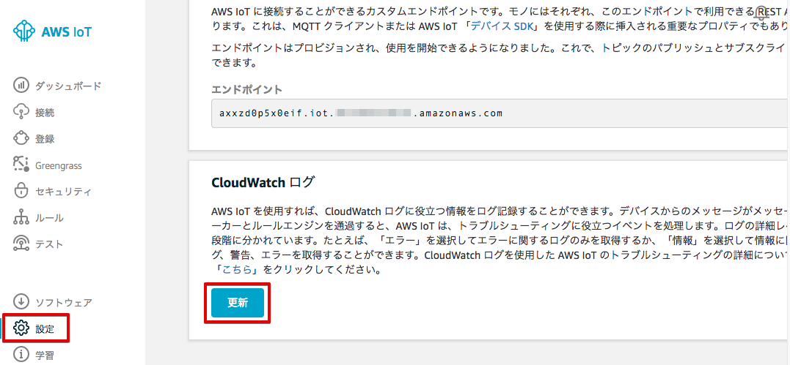
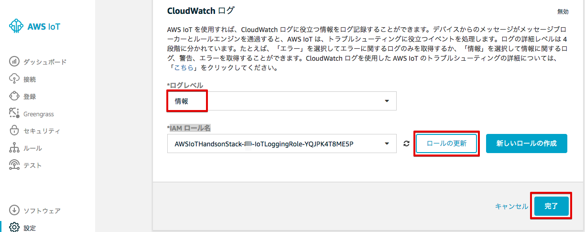
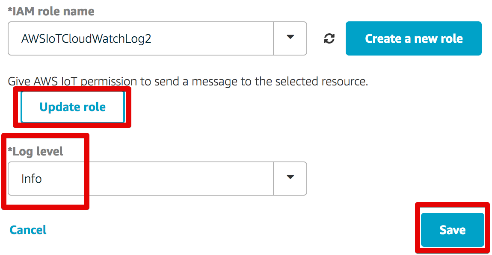
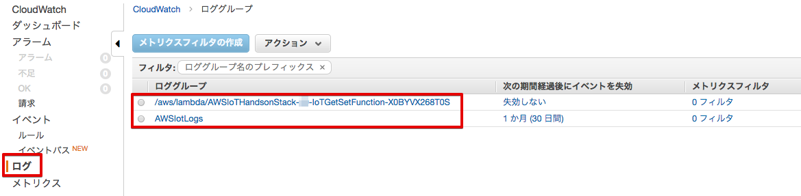

===================================
その他の設定（オプション）
===================================

CloudWatch Logsの設定
=====================

AWS IoTのログはCloudWatch Logsで取得可能です。トラブルシューティングなどに使用する事ができます。

マネージメントコンソールのAWS IoTを開き、[設定] を選択し、[更新] をクリックします。

|

次に、[ログレベル] を [情報] を選択し、[IAM ロール名] に、"AWSIoTHandsonStack-<参加者番号>-IoTLoggingRole-..." を選択し、[ロールの更新] をクリックします。

|

ロールが正常に更新されると、下記のメッセージが表示されます。

|

最後に [終了] をクリックします。

再度"IAM role name"欄から、"AWSIoTCloudWatchLog"を選択し、[Update role]をクリックする。
"Successfully..."と表示されるので、"Log level"で"info"を選択し、[Save]をクリックする。

|

サービス：CloudWatchに移動し、"ログ"というタブをクリックする。

|
