==================
 ハンズオン終了後
==================

ハンズオン終了後のAWSの課金発生を無くすために、今回のハンズオンで使用したハードウェアの後片付けと、作成したAWSのリソースの削除を行います。

ハードウェアの後片付け
============================

プログラムを停止する
-------------------------------

プログラムが動作している場合、Ctrl+C でプログラムを終了します。

ユーザーディレクトリのクリーンアップ
--------------------------------------------------

::

    # cd
    # rm -rf *
    # rm -rf ./.aws
    # rm -f ./.profile
    # rm -f ./.endpoint
    # rm -f ./.reasion

|

Edisonの電源を切る
-------------------------------

Edisonから、DCプラグを抜き、電源を切って下さい。

ハンズオン終了後には以下のAWSの設定を削除してください。

AWS IoTのリソース削除
=====================

AWS IoTの証明書、ポリシー、デバイスを削除するためには、削除前にアタッチされているリソースをデタッチする必要があります。

- マネージメントコンソールのサービスから[AWS IoT]を選択します。
- 削除したい証明書を選択します。
- 関連付けられているデバイスを選択し、[デタッチ] をクリックします。
- 同様にポリシーもデタッチします。

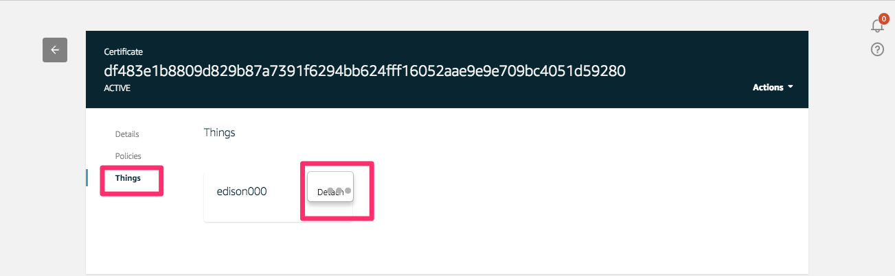

|

- 削除したいリソースを選択し、"Actions"のメニューから"Delete”を選択します。

|

ルールも同様に削除して下さい。

S3バケットの削除
==============================

サービス一覧から[S3]をクリックして開きます。

.. image:: images/6-s3.png

|

“awsiothandsonstack-<参加者番号>-sensorstoragebucket-<英数字>” のバケットをクリックします。

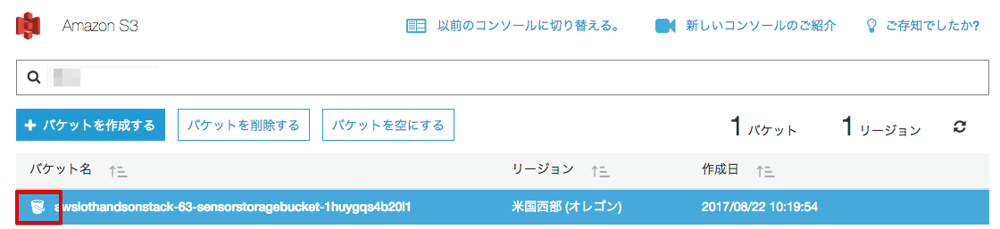

|

バケットの名前を入力して、[確認] をクリックします。

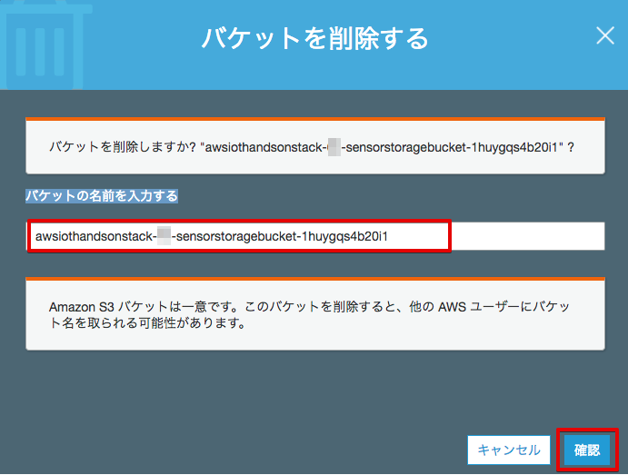

|

Kinesis Firehoseの設定を削除
========================================================

マネージメントコンソールのサービス一覧から[Kinesis]をクリックして開きます。[Firehose コンソールに移動]をクリックし、Kinesis Firehoseの設定画面に移動します。

S3 Delivery Streamsから、"FromIotToS3-<参加者番号>" をチェックし、[アクション]から、"Delete"を選びます。

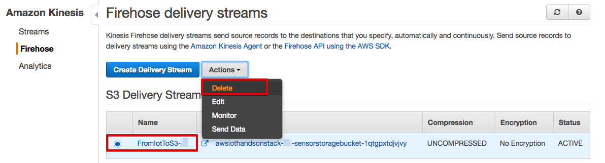

|

確認画面が表示されるので、delivery stream 名を入力し、[Delete]をクリックします。

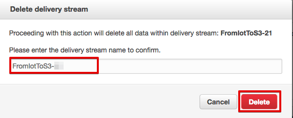

|

ElsticSearch Serviceの設定を削除
========================================================

ElsticSearch Serviceは、オプションシナリオで使用したものです。オプションシナリオ未実施の方は削除する必要はありません。スキップして下さい。

マネージメントコンソールのサービス一覧から[ElsticSearch Service]をクリックして開きます。
ドメイン ”awsioth-sensor-<参加者番号>”をクリックします。

.. image:: images/6-searchable_documents.png

|

画面の下までスクロールし、"Elasticsearch ドメインの削除" をクリックすると、[ドメインの削除] ボタンが表示されるので、クリックします。

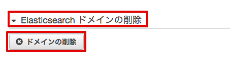

|

確認画面が表示されますので、"ドメインの削除 ...." にェックを入れ、[削除] ボタンをクリックします。

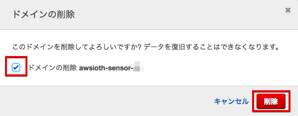

|

Congnite IDプールを削除
========================================================

マネージメントコンソールのサービス一覧から [Cognito] をクリックして開き、[フェデレーテッドアイデンティティの管理] をクリックします。

.. image:: images/2-cognito-1@2x.png

|

”AWSIoTHandson <参加者番号>” をクリックします。

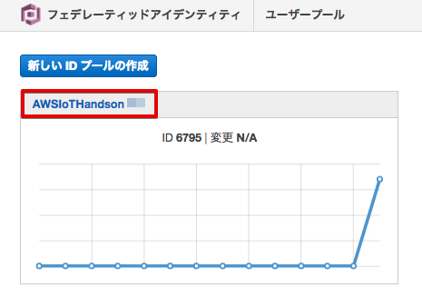

|

[IDプールの編集] をクリックします。

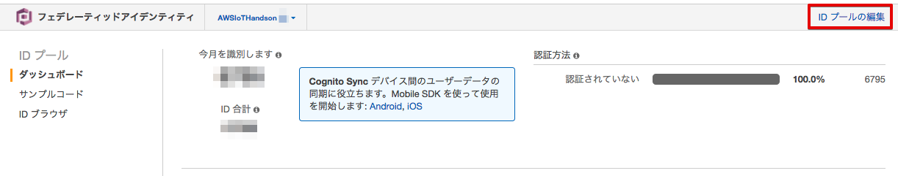

|

[IDプールの削除] をクリックします。

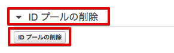

|

確認画面が表示されるので、[プールの削除] をクリックします。

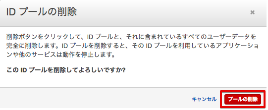

|

CloudFormationスタックの削除
============================

- マネージメントコンソールのサービス一覧から[CloudFormation]をクリックします。
- リストから"AWSIoTHandsonStack"のスタックを選択し、"Actions"から[Delete Stack]をクリックします。

.. image:: images/8-delete-cf-stack-1.png

|

IAMロールを削除
===================================

マネージメントコンソールのサービス一覧から[IAM]をクリックして開きます。
メニューから[ロール]をクリックして下さい。右上の設定アイコンを押して、作成時刻を表示して下さい。
作成事項でソートすると、本ハンズオンで作成したロールが見えます。

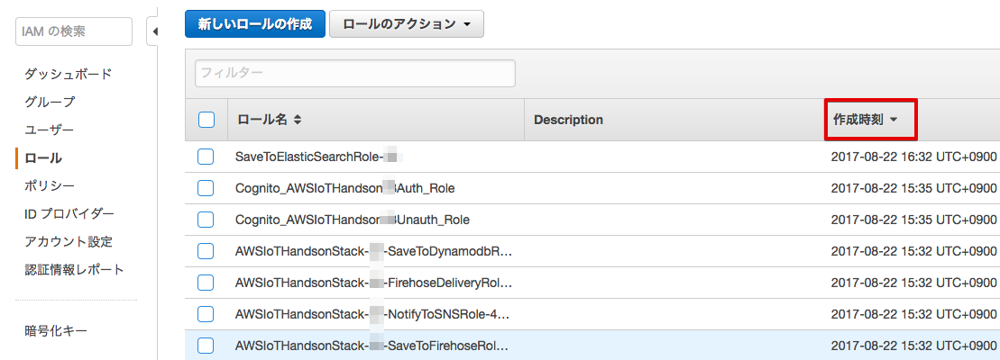

|

本ハンズオンで作成した下記のロールのみにチェックを入れ、[ロールの削除]をクリックして下さい。

SaveToElasticSearchRole-<参加者番号>

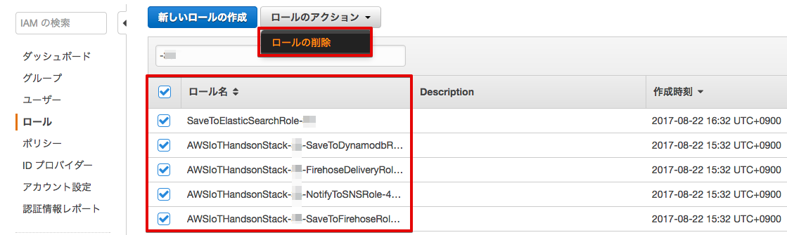

|

確認画面が表示されますので、[はい、削除する]をクリックして下さい。

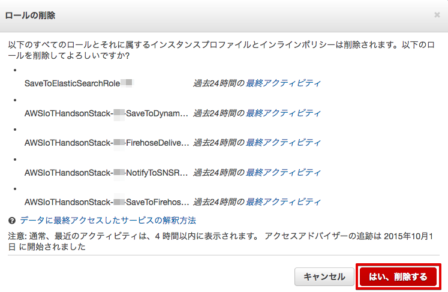

|
